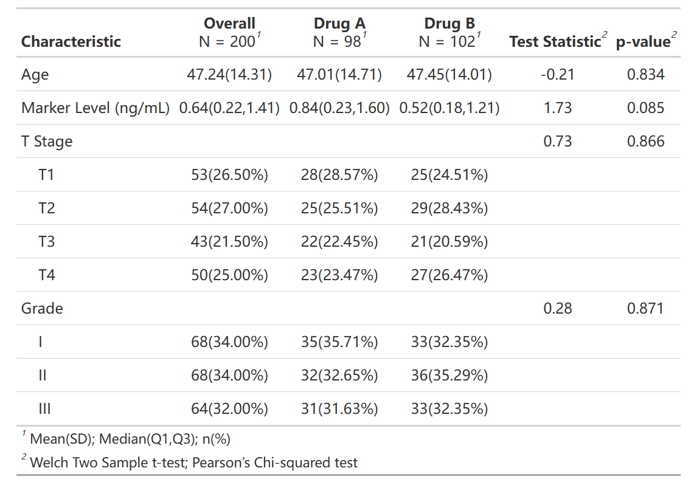
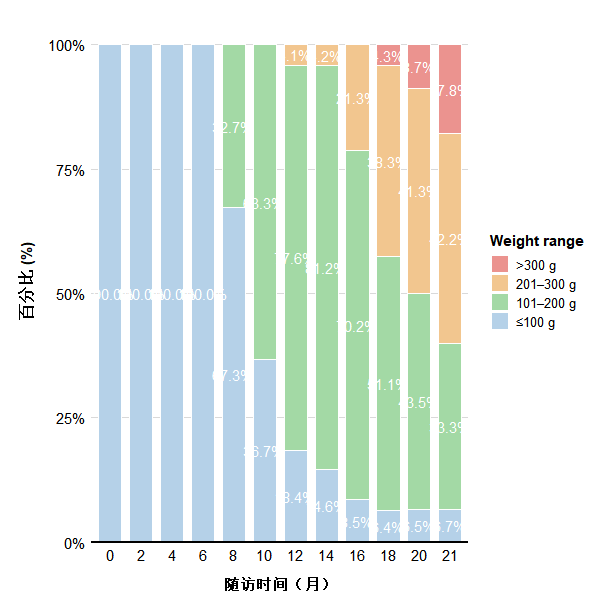
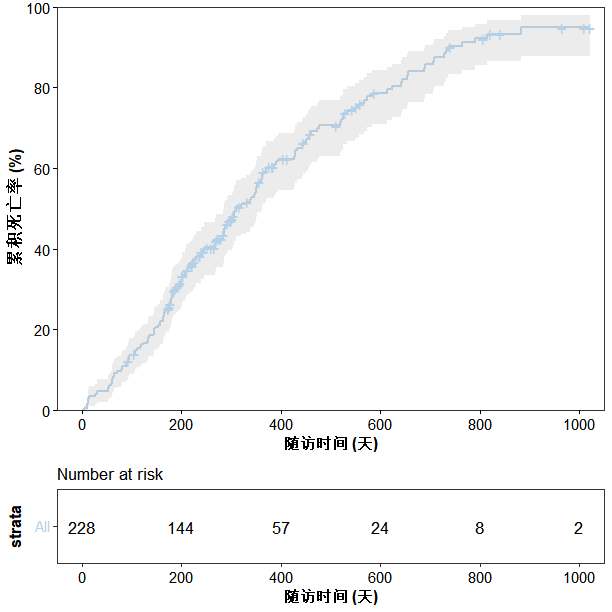
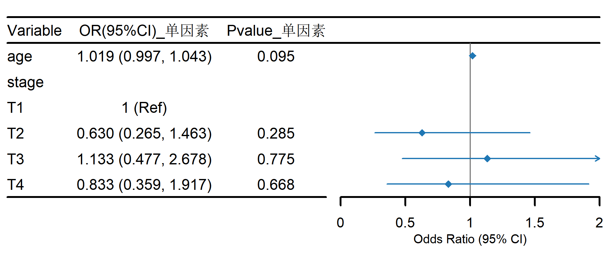
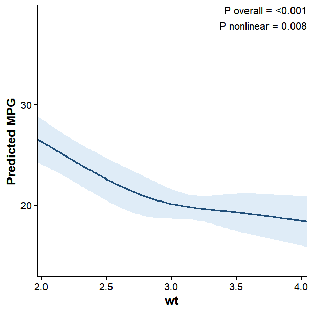
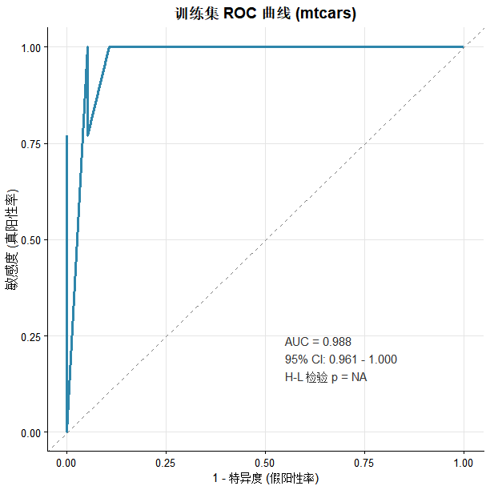

# medstats

**medstats** is an R package designed to streamline common workflows in medical and epidemiological statistics. It provides convenient functions for data processing, statistical modeling, table generation, and publication-quality visualization.

Key features include:

- **Table formatting**: Create publication-ready three-line tables and export them to Word
- **Data processing**: Convert longitudinal data into survival-analysis format and generate baseline characteristic tables
- **Regression analysis**: Perform automated generalized linear models and Cox proportional hazards regression, including univariable and multivariable analyses
- **Repeated-measures analysis**: Fit generalized estimating equation models for longitudinal and correlated data
- **Publication-quality visualization**: Generate Kaplan–Meier curves, forest plots, restricted cubic spline plots, ROC curves, Sankey diagrams, and more

## Installation

Install the development version of **medstats** from GitHub:

```r
# Install the remotes package if necessary
install.packages("remotes")

# Install medstats from GitHub
remotes::install_github("shanjiayu1/medstats")

# Load the package
library(medstats)
```

## Main Features

### Table Formatting

#### Format a `flextable`

The `format_flextable()` function applies a consistent, publication-ready three-line table style.

```r
# Format a data frame
ft <- format_flextable(
  head(mtcars[, 1:5])
)

# Format a gtsummary object
library(gtsummary)

tbl <- tbl_summary(
  trial,
  include = c(age, grade, trt),
  by = trt
)

ft <- format_flextable(tbl)
```

#### Export tables to Word

The `export_word()` function can export multiple tables to a single Word document.

```r
export_word(
  data_list = list(
    head(mtcars),
    head(iris)
  ),
  table_titles = c(
    "Table 1. mtcars Dataset",
    "Table 2. iris Dataset"
  ),
  output_file = "my_tables.docx"
)
```

## Data Processing

### Convert longitudinal data to survival-analysis format

The `long_to_surv_data()` function converts longitudinal clinical records into a dataset suitable for survival analysis.

```r
my_clinical_data <- ChickWeight |>
  mutate(
    is_reach_150g = ifelse(weight >= 150, 1, 0)
  )
surv_data <- long_to_surv_data(
  data = my_clinical_data,
  id_var = "Chick",
  event_flag_var = "is_reach_150g",
  time_var = "Time",
  baseline_vars = c("Diet")
)
```

### Create a baseline characteristics table

The `make_table1()` function generates a baseline characteristics table commonly used as Table 1 in medical research.

```r
make_table1(
  data = trial,
  vars = c("age", "marker", "stage", "grade"),
  specific_vars = "marker",  # Variable with a non-normal distribution
  group_var = "trt"
)
```



### Create a longdata_analysis table

The `longdata_analysis()` function analyzes repeated-measures data to evaluate changes in an outcome over time and compare longitudinal trends between two groups.

```r
library(nlme)  
my_data_2groups <- Orthodont %>%
  as.data.frame() %>% 
  mutate(
    time_str = paste0(age, "岁") # 故意构造文本格式时间："8岁", "10岁"...
  )
results_2groups <- longdata_analysis(
  data          = my_data_2groups,
  id_col        = "Subject",      # 个体ID
  treatment_col = "Sex",          # 分组：男/女（仅2组）
  time_col      = "time_str",     # 时间：8岁/10岁...
  score_col     = "distance"      # 结局指标：距离
)

# 4. 打印结果
print(results_2groups)

```

## Regression Analysis

### Automated generalized linear models

The `run_glm_auto()` function performs automated generalized linear model analyses and summarizes both univariable and multivariable results.

#### Linear regression

```r
run_glm_auto(
  data = mtcars,
  vars = c("hp", "wt"),
  outcome_var = "mpg",
  family = "gaussian"
)
```

#### Logistic regression

```r
run_glm_auto(
  data = trial,
  vars = c("age", "stage"),
  outcome_var = "response",
  family = "binomial"
)
```

### Automated Cox regression

The `run_cox_auto()` function performs automated Cox proportional hazards regression.

```r
run_cox_auto(
  data = lung,
  vars = c("age", "sex"),
  time_var = "time",
  event_var = "status"
)
```

## Data Visualization

### Mean ± standard error line plot

The `plot_meanse()` function visualizes longitudinal changes using group-specific means and standard errors.

```r
my_data <- ChickWeight |>
  filter(Time %in% c(0, 4, 10, 14, 21)) |>   # 挑选第 0,4,10,14,21 天
  mutate(
    time_str = paste0("第", Time, "天"),      # 制造 "第10天" 这种字符串
    Diet_Name = paste0("饮食配方", Diet)      # 把组别从 1,2,3,4 改为有意义的名称
  )

plot_meanse(
  data         = my_data,
  target_var   = "weight",         # 结局指标：体重
  time_var     = "time_str",       # 时间列名："第x天"
  group_var    = "Diet_Name",      # 分组变量："饮食配方x"
  xlab         = "生长天数 (Days)",# 自定义 X 轴标签
  ylab         = "平均体重 (g)",   # 自定义 Y 轴标签
  legend_title = "不同饮食分组",
)
```


### Stacked percentage bar plot

The `plot_stacked()` function categorizes a continuous variable into
intervals and visualizes the percentage distribution of those categories
at each time point.

```r
chick_weight <- ChickWeight
chick_weight$Time <- factor(
  chick_weight$Time,
  levels = sort(unique(chick_weight$Time))
)

plot_stacked(
  data = chick_weight,
  target_var = "weight",
  time_var = "Time",
  breaks = c(-Inf, 100, 200, 300, Inf),
  labels = c("≤100 g", "101–200 g", "201–300 g", ">300 g"),
  colors = c("#B5D1E8", "#A3D9A5", "#F2C68F", "#EB938F"),
  legend_title = "Weight range"
)
```



### Kaplan–Meier survival curve

The `plot_km()` function generates publication-ready Kaplan–Meier survival curves.

```r
lung$status2 <- ifelse(
  lung$status == 2,
  1,
  0
)

plot_km(
  data = lung,
  group_var = "sex",
  time_var = "time",
  status_var = "status2"
)
```



### sankey plot

```r
sankey_data <- datasets::ChickWeight |>
  filter(Time %in% c(0, 10, 20)) |>
  mutate(
    Visit_Time = factor(
      paste0("第 ", Time, " 天"),
      levels = c("第 0 天", "第 10 天", "第 20 天")
    ),
    Weight_Status = case_when(
      weight < 50 ~ "偏瘦 (Light)",
      weight < 150 ~ "正常 (Normal)",
      TRUE ~ "超重 (Overweight)"
    ),
    Weight_Status = factor(
      Weight_Status,
      levels = c(
        "偏瘦 (Light)",
        "正常 (Normal)",
        "超重 (Overweight)"
      )
    )
  )

sankey_plot <- plot_sankey(
  data = sankey_data,
  id_var = "Chick",
  time_var = "Visit_Time",
  state_var = "Weight_Status",
  na_strategy = "show",
  missing_label = "Drop-out (失访)"
)

sankey_plot
```

### forest plot

```r
f_data <- run_glm_auto(
  data = trial,
  vars = c("age", "stage"),
  outcome_var = "response",
  family = "binomial"
)

plot_forest(
  data = f_data[1:3],
  ci_column = 2, 
  x_ticks = c(0, 0.5,1,1.5,2),
  width = 6.5, 
  output_name = "TCM_Forestplot2.png"
)
```

### Restricted cubic spline plot

The `plot_rcs()` function evaluates and visualizes potential nonlinear associations using restricted cubic splines.

```r
#logsitic模型：马力(hp)对自动变速箱(am)的影响，调整体重(wt)，4个节点，OR图
res1 <- plot_rcs(
  data = mtcars,
  exposure = "hp",
  outcome = "am",
  covars = c("wt"),
  nk = 4,
  # ylim=c(0,5),
  model_type = "logistic",
  xlab = "马力(hp)",
  ylab = "自动变速箱概率"
)

res1$plot


#线性模型：体重(wt)对每加仑英里数(mpg)的影响，调整马力(hp)和排量(disp)，4个节点，预测值图
res2 <- plot_rcs(
  data = mtcars,
  exposure = "wt",
  outcome = "mpg",
  covars = c("hp", "disp"),
  model_type = "linear",
  # ylim=c(0,20),
  ylab = "Predicted MPG"
)

res2$plot

#cox模型：年龄(age)对生存时间(time)和状态(status)的影响
res3 <- plot_rcs(
  data = lung,
  exposure = "age",
  outcome = "Surv(time, status)",
  covars = c("sex", "ph.ecog"),
  model_type = "cox",
  ylab = "Hazard Ratio"
)

res3$plot
```

### ROC curve

The `plot_roc()` function evaluates the discrimination performance of a prediction model using a receiver operating characteristic curve.

```r
model <- glm(am ~ mpg + hp + wt, data = mtcars, family = binomial)
train_data <- mtcars
train_data$pred_prob <- predict(model, newdata = train_data, type = "response")

res_train <- plot_roc(
  data = train_data, 
  true_var = "am", 
  pred_var = "pred_prob", 
  title = "训练集 ROC 曲线 (mtcars)",
  line_color = "#2E86AB"   # 蓝色
)
res_train$plot
```
